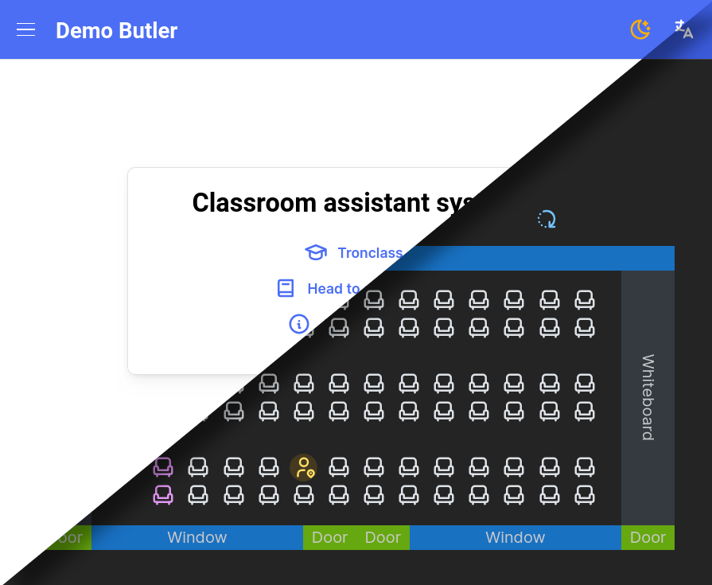

# Demo Butler

> Demo Butler is a project developed for the web programming class.

> This is the V2 branch for Demo Butler. For legacy V1, see: [V1 branch](https://github.com/stanley2058/WPButler/tree/ref/v1) or [V1.0.0](https://github.com/stanley2058/WPButler/tree/v1.0.0).

## Features



See [Features.md](./docs/Features.md) for detail.

## Development

This project uses `pnpm`, follow [the installation guide](https://pnpm.io/installation) if `pnpm` is not yet installed.

### Setup Firebase Credentials

1. Follow Firebase setup steps and retain the credentials.
2. Create `Config.ts` besides `IConfig.ts`, paste in the following template and fill in the fields retained from Firebase.

```typescript
import IConfig from "./IConfig";

const Config: IConfig = {
  firebaseConfig: {
    apiKey: "",
    authDomain: "",
    projectId: "",
    storageBucket: "",
    messagingSenderId: "",
    appId: "",
    measurementId: "",
  },
};
export default Config;
```

### Dev server

This will start a Vite dev server.

```sh
pnpm run dev
```

### Build

This will build the app.

```sh
pnpm run build
```

## Deploy

To deploy this app, you will need to setup a Firebase project (same as in
development). You can create a new project for production (Optional).

After creating the Firebase project, paste in the config to `Config.ts` just
like in development mode.

Then use the following step for deployment:

```sh
# 1. Login to firebase (skip this if you have already logged-in)
firebase login

# 2. Use the new project (select the project in Firebase CLI)
# You only need to do this if it's the first time
firebase use --add

# 3. Build the app
pnpm run build

# 4. Deploy the app
firebase deploy
```

The result should look like this:

```
❯ firebase deploy

=== Deploying to '<your-app>'...

i  deploying hosting
i  hosting[<your-app>]: beginning deploy...
i  hosting[<your-app>]: found 24 files in dist
✔  hosting[<your-app>]: file upload complete
i  hosting[<your-app>]: finalizing version...
✔  hosting[<your-app>]: version finalized
i  hosting[<your-app>]: releasing new version...
✔  hosting[<your-app>]: release complete

✔  Deploy complete!

Project Console: https://console.firebase.google.com/project/<your-app>/overview
Hosting URL: https://<your-app>.web.app
```
