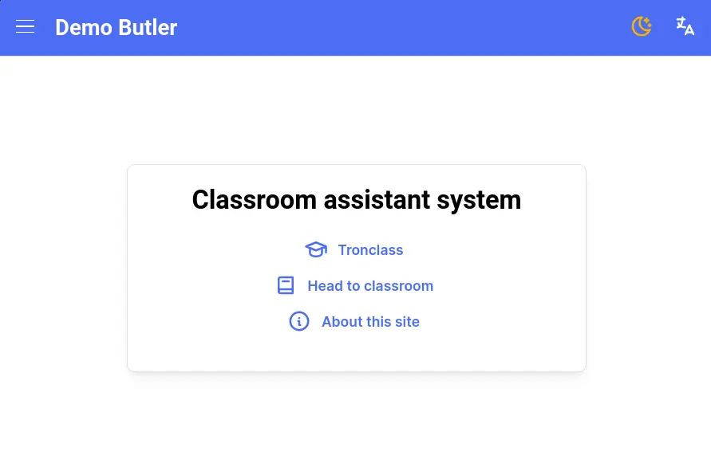
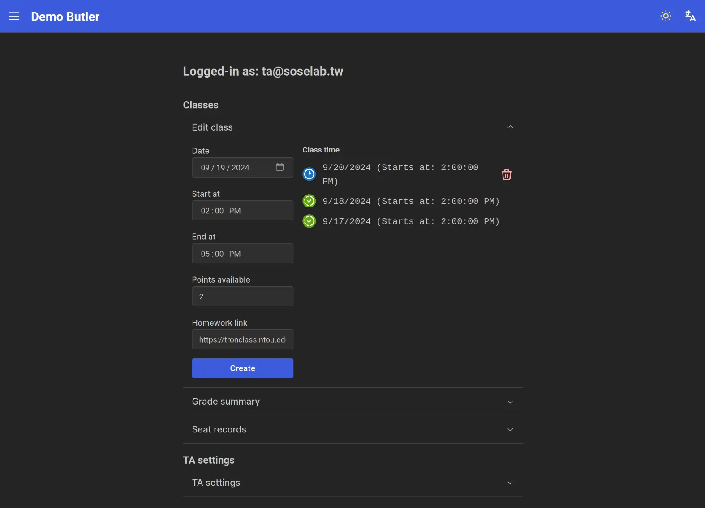

# Features

## Demo

https://github.com/user-attachments/assets/c59f5073-fe83-4155-a099-ecd864026f6b

([DEMO File](./demo.webm))

In the demo showed the following features:

- Student entering classroom and setting up their seat.
- Student attempt to ask for demo.
- Multiple students queued up for demo.
- TA complete the demo for a student with a given point.
- TA manually complete a demo.

## Create a class

To create a class:

1. Set the date.
2. Set the start time and end time.
3. Set the max available points of this class.
4. Set the homework link for this class (Optional).
5. Hit create.

On the right is a list of created classes, you can delete a class that's yet to
happen.

## Others

### General

- Supports 3 languages (English, Traditional and Simplified Chinese).
- Supports light and dark themes.
- Installable (PWA).
- Pages other than the management tab have great RWD capability, works nicely on
  smartphones.
- The app is less than 400KB Gzipped.

### Classroom

- Student will be kicked from the classroom if the class is over.
  - If a student is in the demo queue when the class has ended, they will remain
    in the queue until their demo is completed or they dequeue themself.
- The classroom is rotatable, makes locating a target seat quick and easy.

### TA

- TA can see past grade summary and seat records in TA management tab.
- TA can add another TA in management tab.
- TA can change their password in the management tab.
